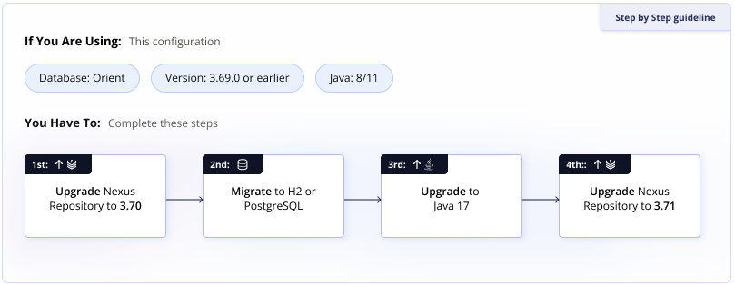

# Ansible Adhoc playbook: Upgrade Nexus to New Version and Migrate to H2 Database

This Ansible playbook automates the process of upgrading a Sonatype Nexus Repository Manager 3 instance to a newer version, including the migration from OrientDB to the H2 database. It's designed to minimize downtime and align with Sonatype's recommended upgrade procedures. This playbook is built upon the excellent work of the https://github.com/ansible-ThoTeam/nexus3-oss team.

## Requirements

* **File Structure:** This playbook assumes a specific file structure under `/opt`, consistent with the ThoTeam role's symlink approach. Ensure your `/opt` directory has a structure similar to the following:

    ```
    /opt/
    ├── nexus-3.69.0-02/
    ├── nexus-3.70.4-02/
    ├── nexus-3.70.4-02-java8-unix.tar.gz
    ├── nexus-3.71.0-06/
    ├── nexus-3.71.0-06-unix.tar.gz
    ├── nexus-3.79.1-04/
    ├── nexus-3.79.1-04-linux-x86_64.tar.gz
    ├── nexus-latest -> /opt/nexus-3.79.1-04
    └── sonatype-work/
    ```

    The `nexus-latest` symlink is crucial as the Nexus service definition typically points to it.

    ```
    cat /etc/systemd/system/nexus.service
    [Unit]
    Description=nexus service
    After=network.target

    [Service]
    Type=forking
    LimitNOFILE=65536
    ExecStart=/opt/nexus-latest/bin/nexus start
    ExecStop=/opt/nexus-latest/bin/nexus stop
    User=nexus
    Restart=on-abort

    [Install]
    WantedBy=multi-user.target
    ```

* **Java:** It is assumed that you have both Java 8 (or 11) and Java 17 installed on the target hosts. The upgrade process will involve switching between these versions.
* **Ansible:** Version 2.9 or later is required.
* **Target Hosts:**
    * An existing installation of Nexus Repository Manager 3 must be present.
    * The Ansible user on the target host needs `` privileges.
    * Python 3 must be installed on the target host.
* **Network:**
    * The Ansible control machine requires network access to the target host(s).
    * The target host(s) must have network access to download the Nexus distribution package and the Nexus DB Migrator JAR from Sonatype.
* **SELinux:** If SELinux is active on the target host, this playbook includes tasks to manage the necessary security context for the Nexus binary.

# Upgrade Guide: OrientDB to H2 and Java Migration

This comprehensive guide details the steps to upgrade your Nexus Repository Manager instance from using OrientDB and an older Java version (8 or 11) to the latest version, which leverages the H2 database and necessitates Java 17.

For in-depth information, please consult the official Sonatype documentation:
[https://help.sonatype.com/en/upgrading-to-nexus-repository-3-71-0-and-beyond.html#instances-using-orientdb--pre-3-70-x--and-java-8-or-11](https://help.sonatype.com/en/upgrading-to-nexus-repository-3-71-0-and-beyond.html#instances-using-orientdb--pre-3-70-x--and-java-8-or-11)



## Step 1: Upgrade to the Latest Nexus Version Supporting OrientDB and Existing Java

Before initiating the migration to H2 and Java 17, it's crucial to first upgrade to the most recent Nexus Repository version that still supports your current database (OrientDB) and Java version (8 or 11). This staged approach ensures a more stable transition.

1.  **Configure Ansible Variables:** Modify the `vars` file associated with your Ansible playbook (e.g., `upgrade_vars.yml`). Set the following variables to target the last OrientDB-compatible Nexus version:

    ```yaml
    nexus_version: "3.70.4-02"
    nexus_package: "nexus-{{ nexus_version }}-java8-unix.tar.gz" # Adjust if you are using Java 11
    ```

2.  **Run Ansible Playbook:** Execute your Ansible playbook (e.g., `adhoc-nexus-version.yml`) to upgrade Nexus to version 3.70.4-02. This playbook should handle downloading the specified package, extracting it to `/opt`, and updating the `nexus-latest` symlink.

    ```bash
    ansible-playbook -i <your inv file> adhoc-nexus-version.yml
    ```

3.  **Manual Verification (Initial):**
    * Log in to the server hosting your Nexus instance.
    * Verify that the `/opt` directory contains the `nexus-latest` symbolic link and that it correctly points to the newly installed Nexus version directory (e.g., `/opt/nexus-3.70.4-02`). Also, confirm that the ownership and permissions of these files and directories are consistent with your previous installation.
    * run this to check you have similar config `diff /opt/nexus-latest/etc/jetty/jetty-https.xml /opt/nexus-3.69.0-02/etc/jetty/jetty-https.xml`

4.  **Start Nexus Service:**
    ```bash
     systemctl start nexus
    ```
5.  **Verify Service Status:** Ensure the Nexus service is running without any errors.

    ```bash
     systemctl status nexus
    ```

## Step 2: Migrate from OrientDB to H2 Database

This critical step involves backing up your OrientDB database, executing the database migration tool provided by Sonatype, and configuring Nexus to utilize the H2 database. **It is strongly recommended to consult the official Sonatype documentation for the most up-to-date and specific instructions for your Nexus version:** [https://help.sonatype.com/en/upgrading-to-nexus-repository-3-71-0-and-beyond.html#upgrading-to-3-71-0--for-instances-using-orientdb--nexus-repository-3-70-x--and-java-8-or-11](https://help.sonatype.com/en/upgrading-to-nexus-repository-3-71-0-and-beyond.html#upgrading-to-3-71-0--for-instances-using-orientdb--nexus-repository-3-70-x--and-java-8-or-11)

1.  **Backup OrientDB Database:** Before proceeding with the migration, create a backup of your current OrientDB database. You can achieve this through the Nexus UI:
    * Navigate to "Administration" -> "System" -> "Tasks".
    * Look for the "Export Database for backup" task and run it.
    * Download the generated backup file to a secure location. e.g. nexus_backup_dir `/var/my-nexus-backup`.

2.  **Stop Nexus Service:**

    ```bash
    sudo systemctl stop nexus
    ```

3.  **Run Database Migrator:** Execute the Nexus DB migrator JAR file. Adjust the memory allocation parameters (`-Xmx`, `-Xms`, `-XX:MaxDirectMemorySize`) based on your server's resources and Sonatype's recommendations. Ensure you are in the directory where the `nexus-db-migrator-3.70.4-02.jar` file is located.

    ```bash
    sudo java -Xmx2703M -Xms2703M -XX:+UseG1GC -XX:MaxDirectMemorySize=2703M -jar nexus-db-migrator-3.70.4-02.jar --migration_type=h2
    ```

4.  **Move H2 Database File:** After the migration tool completes successfully, it will generate an `nexus.mv.db` file (and potentially other related files). Copy this file to the designated Nexus data directory. The default location is typically under `/var/nexus/db`.

    ```bash
    sudo cp nexus.mv.db /var/nexus/db
    ```

5.  **Set File Ownership:** Ensure the `nexus` user and group have the correct ownership of the migrated H2 database file.

    ```bash
    sudo chown nexus:nexus /var/nexus/db/nexus.mv.db
    ```

6.  **Enable H2 Datastore:** Modify the `nexus.properties` file to instruct Nexus to use the H2 datastore. This file is usually located in `/var/nexus/etc/`.

    ```bash
    sudo nano /var/nexus/etc/nexus.properties
    ```

    Add or modify the following line:

    ```properties
    nexus.datastore.enabled=true
    ```

    Save and close the file.

7.  **Start Nexus Service:**

    ```bash
    sudo systemctl start nexus
    ```

8.  **Verify Service Status:** Confirm that the Nexus service starts successfully after the database migration.

    ```bash
    sudo systemctl status nexus
    ```

## Step 3: Verify H2 Database Migration

After starting Nexus with the H2 database, perform these checks to confirm the migration was successful and that Nexus is functioning correctly.

1.  **Check Logs:** Examine the Nexus server logs (typically in `/var/nexus/log/`) for any errors or warnings related to the database migration or startup.

2.  **Inspect Tasks:** Log in to the Nexus UI and navigate to the "Tasks" section (Administration -> System -> Tasks). Look for a "Backup H2 database" task. Its presence indicates that Nexus has successfully initialized and is using the H2 database.

3.  **Verify Configuration:** Review your Nexus configuration, including security realms, repositories, and other settings, to ensure they are consistent with your previous setup.

4.  **Perform Smoke Tests:** Conduct basic functional tests to verify core Nexus operations:
    * Attempt to download an artifact (e.g., a `.jar`, `.war`, or `.tar.gz` file).
    * Try to upload a new artifact or update an existing one (if applicable).
    * Browse your repositories to ensure the expected content is present.

## Step 4: Upgrade Java and Nexus Version Simultaneously

With the successful migration to the H2 database, you can now proceed to upgrade Java to version 17 and then upgrade to the latest desired Nexus Repository version.

1.  **Stop Nexus Service:**

    ```bash
     systemctl stop nexus
    ```

2.  **Remove Old Java Version:** Use your system's package manager to uninstall the previous Java version (e.g., Java 8 or 11). For example, on Debian/Ubuntu:

    ```bash
     apt-get remove --purge -y openjdk-8-jre openjdk-8-jdk # Or appropriate Java 11 packages
     apt-get autoremove -y
    ```

    On Red Hat/CentOS/AlmaLinux:

    ```bash
     dnf remove -y java-1.8.0-openjdk* java-11-openjdk*
    ```

3.  **Install Java 17:** Install the OpenJDK 17 package using your system's package manager.

    On Debian/Ubuntu:

    ```bash
     apt-get update
     apt-get install -y openjdk-17-jdk
    ```

    On Red Hat/CentOS/AlmaLinux:

    ```bash
     dnf install -y java-17-openjdk-devel # Or just java-17-openjdk
    ```

4.  **Update Ansible Variables:** Modify your Ansible `vars` file again to specify the target latest Nexus version. Ensure the `nexus_package` variable reflects the correct filename for the latest version (which typically does not have `-java8` or similar in the name).

    ```yaml
    nexus_version: "3.79.1-04" # Replace with the actual latest version you want to install
    nexus_package: "nexus-{{ nexus_version }}-linux-x86_64.tar.gz" # Adjust based on the package type
    ```

5.  **Run Ansible Playbook:** Execute your Ansible playbook (e.g., `adhoc-nexus-version.yml`) to upgrade Nexus to the specified latest version. This will download the new package, extract it to `/opt`, and update the `nexus-latest` symlink.

    ```bash
    ansible-playbook adhoc-nexus-version.yml
    ```

6.  **Start Nexus Service:**

    ```bash
     systemctl start nexus
    ```

7.  **Verify System Operation:** Thoroughly test your Nexus instance after the Java and Nexus version upgrade. Ensure all functionalities, including artifact uploads, downloads, browsing, and any integrations, are working as expected. Monitor the server logs for any new warnings or errors.

## Step 5: Final Cleanup

After the successful upgrade and thorough verification, perform the following cleanup tasks.

1.  **Remove Old Files:** If you are confident in the new installation, you can remove the older Nexus installation directories under `/opt` (e.g., `nexus-3.70.4-02/`). However, it's often wise to keep one previous version as a fallback for a short period.

2.  **Manage Backup Tasks:** Review the scheduled tasks in the Nexus UI (Administration -> System -> Tasks). If you have implemented your own robust backup strategy, you might consider disabling or removing the default "Backup H2 database" task to avoid redundancy.